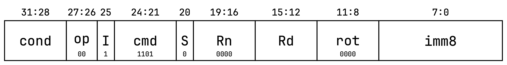
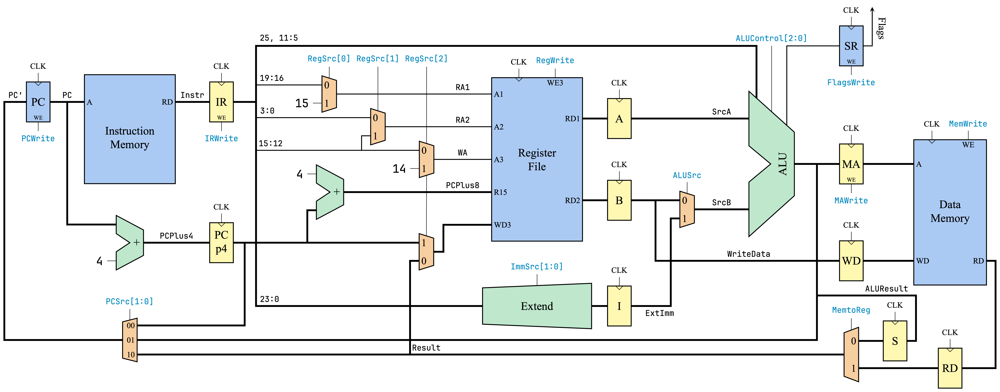

# ARM Multicycle Processor

Below are provided the details of the ARM multicycle processor that was implemented as a project for the Computer Architecture course at the University of Athens.

Specifically, the information is depicted pictorially and covers the instruction fields of the implemented instructions, the datapath, the control unit, and a recommendation for an additional instruction that could be implemented.

## Instruction Implemented

### Data Processing

- `ADD(S)-I`: 
- `ADD(S)-R`: 
- `SUB(S)-I`: 
- `SUB(S)-R`: 
- `CMP-I`: 
- `CMP-R`: 
- `AND(S)-I`: 
- `AND(S)-R`: 
- `XOR(S)-I`: 
- `XOR(S)-R`: 
- `MOV-I`: 
- `MOV-R`: 
- `LSL`: 
- `ASR`: 
- `MVN-I`: 
- `MVN-R`: 

### Memory Access

- `LDR-I`: 
- `STR-I`: 

### Branch

- `B`: 
- `BL`: 

## Datapath

The control signals that come from the control unit are drawn in cyan color.

## Control Unit

### Structure

### Instruction Decoder

### FSM Schematic

### Conditional Decoding

## Recommendation (Not Implemented)

### Instruction Fields

### Datapath of the `ROR` Command

Paths thar are activated by the `ROR` command are drawn in red color.

